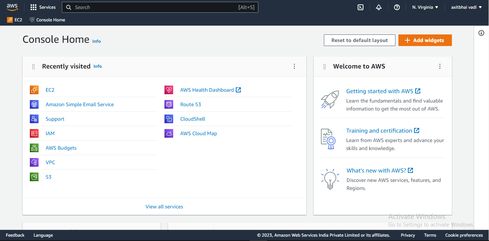
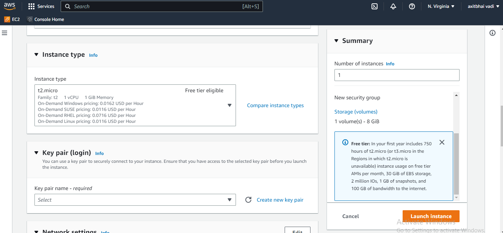
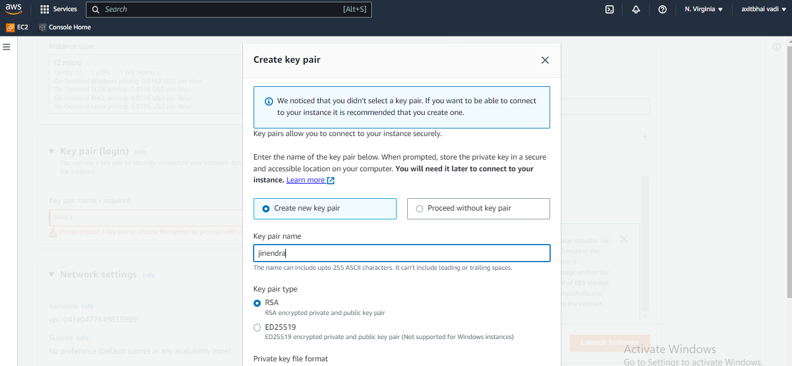
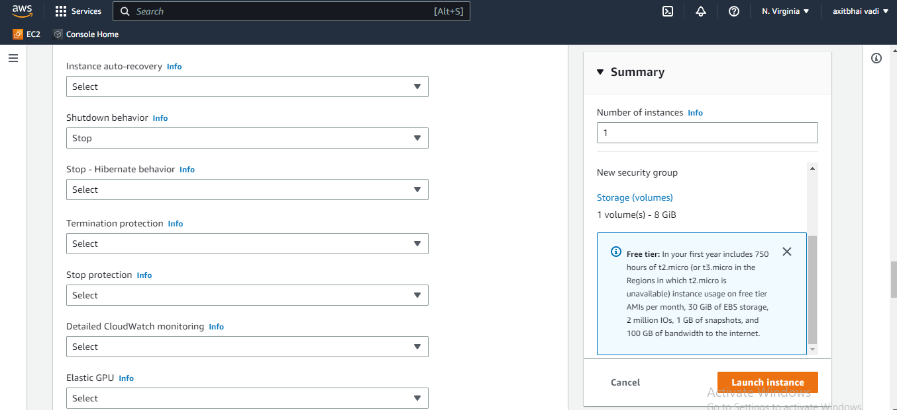
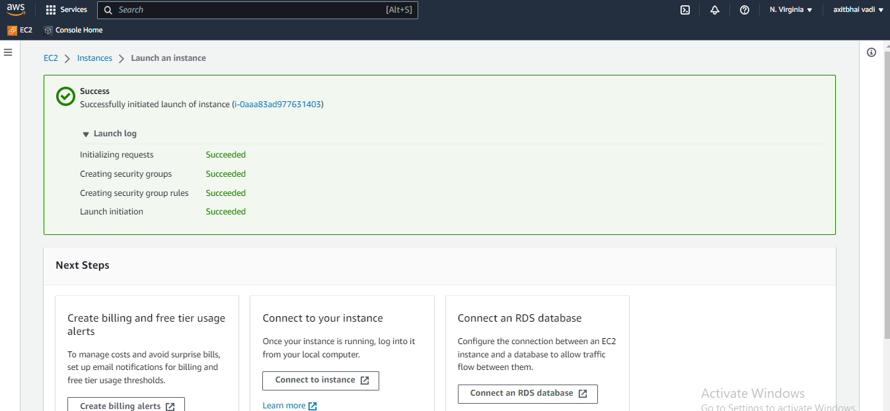

# Deploy single/multiple Node.js apps on AWS EC2 instance with live domains, Nginx.

## Introduction

### Node.js

Node.js is an open-source, cross-platform, JavaScript runtime environment that executes JavaScript code outside a web browser. Node.js is built on open-source V8 JavaScript engine for easily building fast and scalable network applications. Node.js uses an event-driven, non-blocking I/O model that makes it lightweight and efficient, perfect for data-intensive real-time applications that run across distributed devices.

### AWS

AWS is a platform that offers flexible, reliable, scalable, easy-to-use and cost-effective cloud computing solutions and is offered by Amazon. The platform is developed with a combination of infrastructure as a service (IaaS), platform as a service (PaaS) and packaged software as a service (SaaS) offerings.

### EC2

EC2 or Elastic Compute Cloud is a web service that provides secure, resizable compute capacity in the cloud. Amazon EC2’s simple web service interface allows you to obtain and configure capacity with minimal friction. It provides you with complete control of your computing resources and lets you run on Amazon’s proven computing environment.

### Cloudflare

Cloudflare is an American web-infrastructure and website-security company, providing content-delivery-network services, DDoS mitigation, Internet security, and distributed domain-name-server services.

### Git

Git is a distributed version control system for tracking changes in source code during software development.

## What we are going to implement

1. What we are going to implement
2. Create an AWS account
3. Launch an Ubuntu EC2 instance
4. SSH into our instance
5. Install Node.js and Git
6. Clone repository from GitHub
7. Run the node.js app
8. Open different ports for the node instances
9. Make the app running using PM2
10. Configure Nginx for single and multiple node.js apps
11. Configure Nginx to autostart whenever instance will be rebooted
12. Purchase a domain from Godaddy, Namecheap, etc.
13. Configure domain name for our server
14. Configure subdomains for our server
15. Setup SSL with Cloudflare

### create an AWS Account

We are using AWS EC2 server for hosting our multiple node.js apps. So, It is must to have an AWS account. Let’s start and create if you are not having one. For new users, there is an offer of 750 hours free per month up to a year. You must have a credit/debit card before start registering.

### Note: If you are already having an AWS account then you can skip this step and just login to your instance.

1. Open [AWS](https://aws.amazon.com) and Click on Create an AWS account.
2. After this, you will be asked to choose a support plan. Choose a basic plan which is free or choose another one if you want extra features.
3. Now you’ve successfully created your account. Now simply log in to the AWS console.

### Launch an Ubuntu EC2 instance 

Now to host our node.js apps we need an **EC2 virtual machine or instance**. So let’s get started to make our first EC2 instance up.

1. Log in to [AWS](https://aws.amazon.com) and click on the Sign in to the Console. Open your AWS console.
2. Click on EC2 in the All Services section.

3. You will see a screen like below. Where all the currently running instances can be shown. Now click on the Running instances.

### Note:  Right now I am having 1 instances and other services running so it is displaying there. But if you are new then there are 0 displaying.

![AWS console image]!

4. After clicking on Running Instances you’ll see a Launch Instance button there.

5. Now, click on the Launch Instance button. After clicking you will see a page like this which shows the type of OS with the config you want in your machine e.i. We are going to use a Ubuntu Server 22.04 LTS 64-bit (x86).

![AWS Launch instance image]!(https://user-images.githubusercontent.com/98725622/221650590-5aa7487f-983a-4155-a48e-e453b7bd769a.png)

6. create new key pair if you are not already have. give a name of key and select format of key if you are windows user and connect your server using putty then select .ppk type or if you wish to use with open ssh then choose .pem type.

6. In advance details select Shutdown behavior to stop

7. click on launch instance button

8. Now we successfully launch our instance and click on  view all instances.

9. After instance initialization, select the instance and click on connect. Then we can easily connect to our instance in browser, on Mac terminal by .pem file, and on Windows by using putty.

